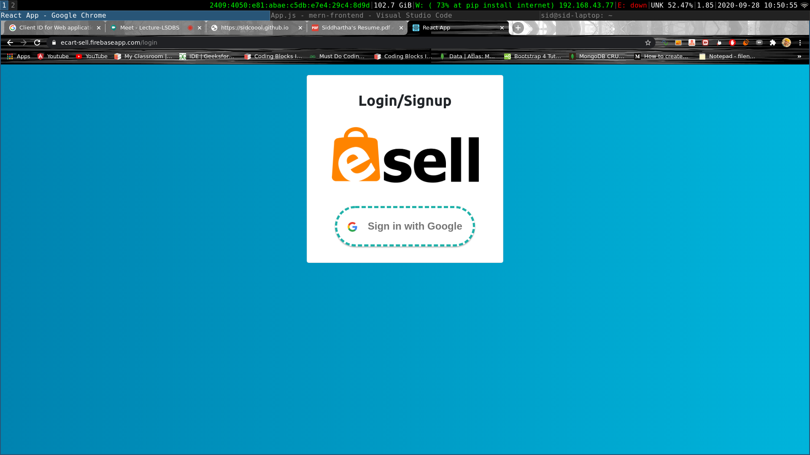

# Project Description
ECart Node Backend API for adding, updating, retrieving, deleting services and goods such as electronics, fashion items, furniture, household goods, cars and bikes

## Frontend Repository
[Go to Frontend Repository](https://github.com/sidcoool/ECart-React-Frontend)


## Features
- Login/Signup using Google and Logout
- View Products.
- Add your own personal Items
- Add Products/Items in your Wishlist etc

## Built With
- NodeJS
- Express
- MongoDB

## Folder Structure
```
├── index.js
├── mongoFun.js
├── package.json
├── credentials.js
├── package-lock.json
├── README.md
├── routes
│   └── products.js
└── uploads
```

## Sreenshots



## Contact

Siddhartha Goel - [Linkedin](https://linkedin.com/in/siddhartha-goel-b2098117a) – siddharthagoel1998@gmail.com
Distributed under the MIT license. See ``LICENSE`` for more information.

[![License][license-image]][license-url]

[license-image]:https://img.shields.io/badge/license-MIT-blue.svg

[license-url]:https://raw.githubusercontent.com/clamytoe/pyTrack/master/LICENSE


